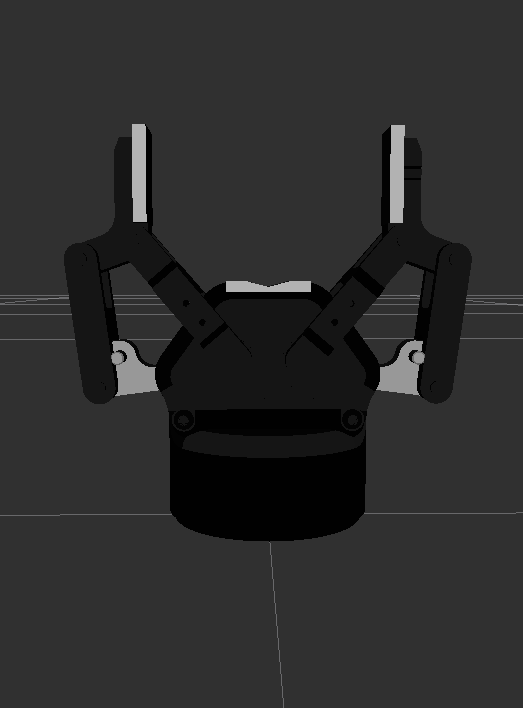
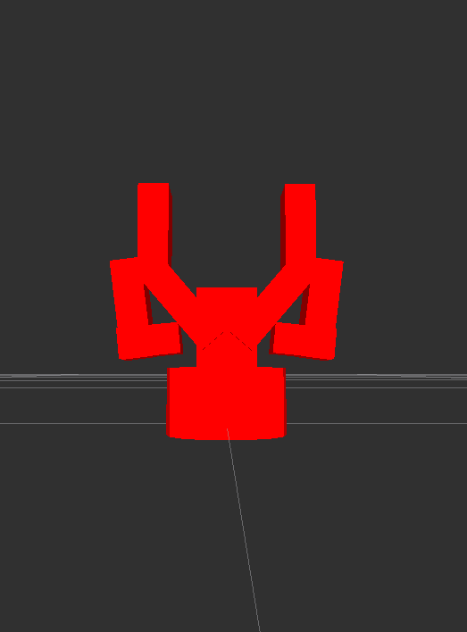
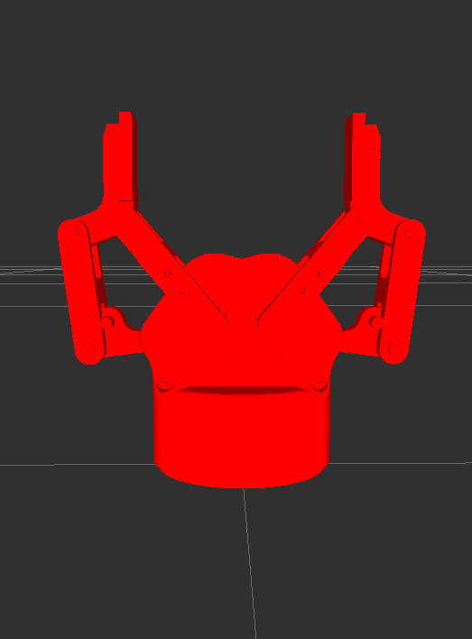

# Robotiq C description package

This package contents the urdf model macros of the 85mm and 140mm stroke models of the [Robotiq 2-finger adaptive grippers](http://robotiq.com/products/adaptive-robot-gripper/).

## Content

The `launch` and `robot` shows a quick example out-of-the box for visualization that you can invoke directly with `roslaunch robotiq_c_description display.launch`.

The relevant folder is `model` that contains firstly all geometries and parameters used for robotic applications and simulation. 

This is the visual geometry (the 85mm model)

For a model to be instantiated, there are two __mandatory__ parameters `parent` and `name`, and three __optional__ parameters that are the `origin`, `precise_collision` and the `adaptive_transmission`.

- `name` is your model instance (equivalent to `prefix` in ros-industrial), but here it is mandatory to name the device, since it is always related to the hardware interface package. No underscore `_` is needed by the way.

- `parent` is a the link name to which `name` is attached to. Within the model there is a fixed joints that does that.

- `origin` is the same origin block from urdf specs, that sets where is `name` with respect to `parent`. If not set, it uses the identity transformation.

- `precise_collision` is set to `false` by default, and it selects whether to use a coarse approximation or a precise collision geometry.

This is the coarse approximation (`precise_collision=false`)

and this is the precise collision (`precise_collision=false`)

- `adaptive_transmission` is set to `false` by default, and it selects whether to use a pure mimic joint motion or use adaptivity in the motion.

